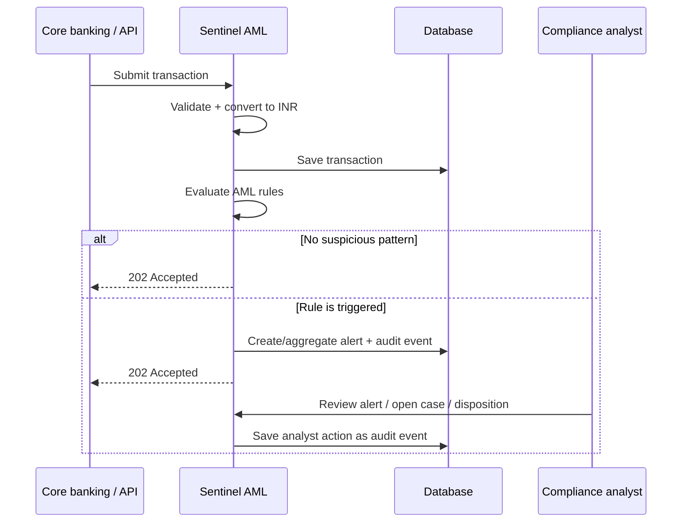
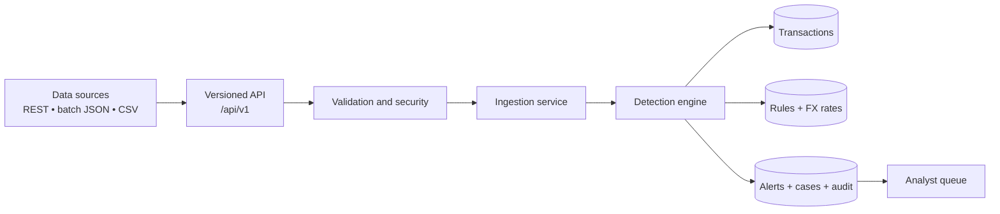
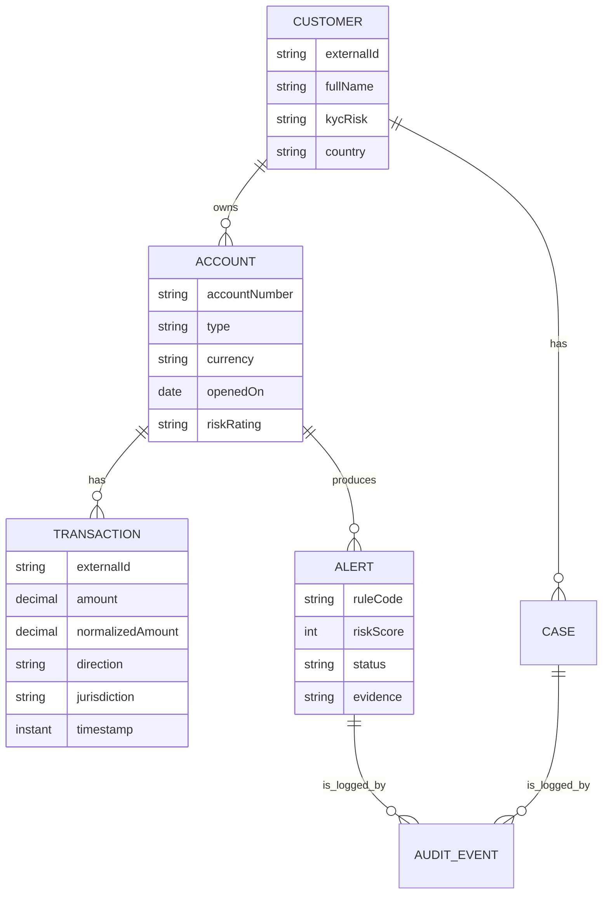
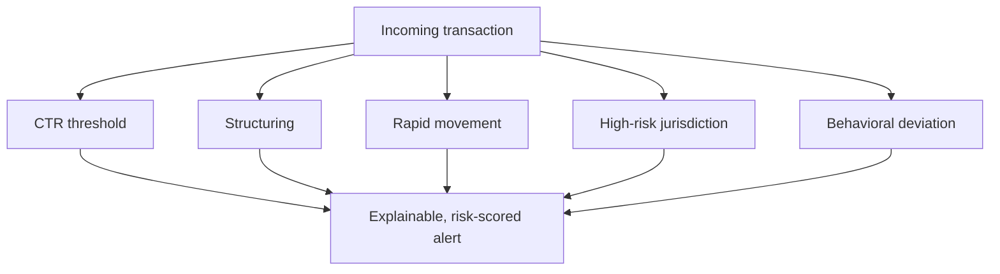
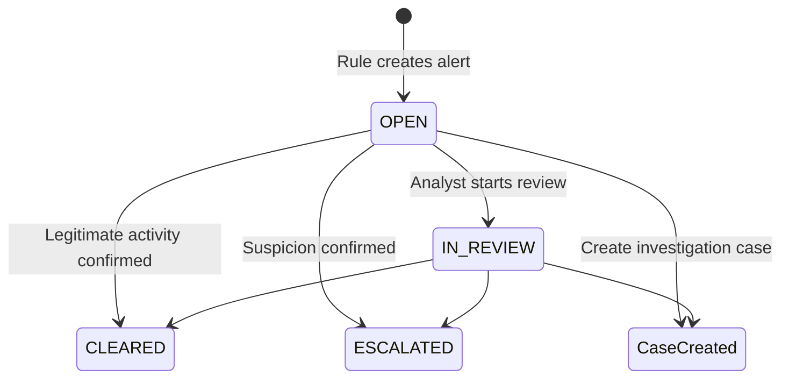

# Sentinel AML — hackathon prototype

Spring Boot 3 / Java 17 transaction-monitoring API for MeridianTrust. It ingests KYC, accounts and transactions, evaluates rules synchronously, produces risk-scored de-duplicated alerts, and records immutable case/alert audit events.

## Run

1. Set the credentials in your shell (see `.env.example`). PowerShell: `$env:SENTINEL_API_USERNAME='analyst'; $env:SENTINEL_API_PASSWORD='your-password'`.
2. Run `mvn spring-boot:run` (or import as a Maven project in IntelliJ).
3. Open `http://localhost:8080/swagger-ui.html`; use HTTP Basic credentials from step 1.

It starts on H2 for a zero-setup demo. For PostgreSQL set `DATABASE_URL`, `DATABASE_USERNAME`, and `DATABASE_PASSWORD`; `src/main/resources/db/migration/V1__sentinel_schema.sql` is the documented initial schema.

## Demo flow
Main API flow
1. Create customer → POST /api/v1/customers
   {
   "externalId": "CUST-1002",
   "fullName": "Priya Sharma",
   "kycRisk": "HIGH",
   "country": "IN"
   }
2. Create account → POST /api/v1/accounts
   {
   "accountNumber": "IN-ACC-1002",
   "customerExternalId": "CUST-1002",
   "type": "CURRENT",
   "currency": "INR",
   "riskRating": "HIGH"
   }
3. Ingest a transaction → POST /api/v1/transactions
   {
   "externalId": "TXN-10001",
   "accountNumber": "IN-ACC-1002",
   "amount": 15000,
   "currency": "INR",
   "direction": "CREDIT",
   "counterparty": "Example Trading Pvt Ltd",
   "jurisdiction": "IN",
   "channel": "NEFT",
   "timestamp": "2026-09-19T10:00:00Z"
   }
   This returns 202 Accepted and evaluates all enabled AML rules immediately.
   Alert APIs
   GET /api/v1/alerts
   Shows the prioritized analyst queue. Customer name and account number are masked.
   GET /api/v1/alerts/{id}
   Shows full alert evidence and explanation.
   PATCH /api/v1/alerts/{id}/disposition
   Closes/escalates an alert while preserving audit history.
   {
   "status": "CLEARED",
   "reason": "Analyst verified legitimate salary payment."
   }
   Supported statuses: OPEN, IN_REVIEW, CLEARED, ESCALATED.
   POST /api/v1/alerts/{id}/cases
   Creates an investigation case from an alert.
   Rule configuration APIs
   GET /api/v1/rules
   Lists rule settings.
   PUT /api/v1/rules/{code}
   Updates a rule without redeploying. Requires the ADMIN role.
   {
   "enabled": true,
   "threshold": 10000,
   "windowHours": 24,
   "score": 90
   }
   Rule codes:
- CTR — transaction of INR 10,000+
- STRUCTURING — 3+ INR 9,000–9,999 transactions in 24 hours
- RAPID_MOVEMENT — 80%+ funds moved out within 48 hours
- HIGH_RISK — configured high-risk jurisdiction (IR, KP, SY, AF)
- BEHAVIOR — daily activity above 3× historical baseline
  GET /api/v1/fx-rates
  Lists configured currency-to-INR normalization rates.
  Quick Swagger demo: structuring
  The seeded account is IN-DEMO-1001. Submit these three transaction payloads within the same day, changing externalId each time:
  {
  "externalId": "STRUCT-DEMO-1",
  "accountNumber": "IN-DEMO-1001",
  "amount": 9500,
  "currency": "INR",
  "direction": "CREDIT",
  "counterparty": "Walk-in Cash Deposit",
  "jurisdiction": "IN",
  "channel": "BRANCH",
  "timestamp": "2026-09-19T09:00:00Z"
  }
  Use STRUCT-DEMO-2 at 10:00:00Z, then STRUCT-DEMO-3 at 11:00:00Z. Finally call GET /api/v1/alerts; the queue will contain a STRUCTURING alert with the transaction IDs in its evidence.
The application seeds `CUST-DEMO-001` and account `IN-DEMO-1001`. POST three INR 9,500 credits during the same 24 hours to `/api/v1/transactions`; the third creates a **STRUCTURING** alert. Post an INR 10,000+ transaction for **CTR**, a debit at least 80% of recent credits for **RAPID_MOVEMENT**, or a transaction whose jurisdiction is `IR`, `KP`, `SY`, or `AF` for **HIGH_RISK**. Then GET `/api/v1/alerts`, POST `/api/v1/alerts/{id}/cases`, and PATCH `/api/v1/alerts/{id}/disposition` with `{"status":"CLEARED","reason":"review complete"}`.

## Architecture / safeguards

`controller → SentinelService → Spring Data JPA` keeps detection in one transactional write path, making transaction ingestion and alert de-duplication atomic (unique `(account, rule, dedupeKey)`). Rules and INR FX rates live in DB tables and are adjustable through `/api/v1/rules` (ADMIN). List views mask PII/account numbers; full alert detail requires authenticated access. API errors use a stable JSON envelope, validation is Bean Validation-based, and alert/case transitions append `audit_events` rather than deleting history.

Rules shipped: CTR threshold, 24-hour structuring, 48-hour rapid movement, high-risk jurisdiction, and 90-day behavioral deviation. Default scores are configurable and alerts are sorted by risk score.

## ERD

`Customer 1—* Account 1—* Transaction`; `Account 1—* Alert`; `Customer 1—* Case`; `Alert/Case 1—* AuditEvent`. Supporting tables: `rule_configs`, `exchange_rates`.
# Sentinel AML

## Real-time money-laundering detection for MeridianTrust Bank

Sentinel is a Spring Boot prototype that turns raw transaction data into explainable AML alerts. It is built for a compliance analyst: ingest a transaction, understand *why* it was flagged, inspect the supporting transactions, open a case, and record a disposition without losing the audit trail.

**Tech:** Java 17 · Spring Boot · Spring Data JPA · Spring Security · H2 (demo) · PostgreSQL-ready · OpenAPI/Swagger

---

## The key product decision

### Does a detected transaction complete?

**Yes, in the current prototype.** Sentinel is a transaction-monitoring system, so it saves the transaction and immediately creates an alert when a detection rule matches. It does **not** automatically reverse, reject, freeze, or block the payment.

This is intentional for the hackathon demo: analysts make the final decision through the case workflow. A future “payment-control” extension can use the same risk score to mark high-risk transactions as `PENDING_REVIEW` or `BLOCKED` before funds move.



---

## Architecture at a glance



### Main components

| Layer | Responsibility |
|---|---|
| API controller | REST endpoints, request validation, standard HTTP responses. |
| Security | HTTP Basic authentication; analysts access AML APIs and admins manage rules. |
| `SentinelService` | Ingests records, performs INR conversion, evaluates rules, and writes alerts. |
| Rule configuration | Rule enablement, thresholds, windows, and risk scores are persisted in `rule_configs`. |
| Persistence | Spring Data JPA stores customers, accounts, transactions, alerts, cases, audit events, and FX rates. |

---

## Financial data model



### INR normalization

Every transaction has its native amount and an INR-normalized amount. The detection engine compares normalized values, allowing rules to work consistently across currencies. Rates are maintained through the `exchange_rates` table and exposed by `GET /api/v1/fx-rates`.

---

## Detection rules: what Sentinel catches



| Rule | What it detects | Default configuration | Why it matters |
|---|---|---|---|
| `CTR` | A single high-value transaction. | INR 10,000 or more · score **75** | Captures reportable cash-transfer-style activity. |
| `STRUCTURING` | Repeated transactions deliberately just under the threshold. | 3 or more INR 9,000–9,999 credits in 24 hours · score **90** | Detects “smurfing,” where one large amount is split to avoid reporting. |
| `RAPID_MOVEMENT` | Funds that quickly leave after arriving. | Debit is at least 80% of credits from previous 48 hours · score **85** | Detects layering, which obscures the source of funds. |
| `HIGH_RISK` | Transfers involving configured risky jurisdictions. | `IR`, `KP`, `SY`, `AF` · score **95** | Jurisdiction exposure is always reviewed, regardless of amount. |
| `BEHAVIOR` | Activity unusual for a customer’s normal profile. | Daily value exceeds 3× 90-day daily average · score **70** | Finds anomalies missed by fixed thresholds. |

### Evidence an analyst receives

Each alert includes:

- **Rule code and risk score** — determines its position in the queue.
- **Human-readable explanation** — explains the precise rule match.
- **Supporting transaction IDs** — e.g. all three deposits that caused a structuring alert.
- **Account/customer context** — masked in the alert queue, available in authenticated detail view.
- **Immutable actions** — creation, disposition, and case events are recorded as audit events.

### Duplicate-alert protection

If multiple transactions match the same rule for the same account and time period, Sentinel aggregates them using an account + rule + window key. This prevents 50 repeated alerts for one underlying behavior while retaining its evidence.

---

## Run the project

### Prerequisites

- Java 17 or later
- Maven 3.9 or later

### Start in demo mode

```powershell
$env:SENTINEL_API_USERNAME='analyst'
$env:SENTINEL_API_PASSWORD='choose-a-strong-local-password'
mvn spring-boot:run
```

Then open [Swagger UI](http://localhost:8080/swagger-ui.html). Click **Authorize** and enter the username/password set above.

The default H2 database includes:

| Seeded item | Value |
|---|---|
| Customer | `CUST-DEMO-001` — Aarav Mehta |
| Account | `IN-DEMO-1001` |
| Default currency | INR |

### PostgreSQL mode

Provide these environment variables before starting:

```powershell
$env:DATABASE_URL='jdbc:postgresql://localhost:5432/sentinel'
$env:DATABASE_USERNAME='sentinel'
$env:DATABASE_PASSWORD='replace-me'
```

The documented initial PostgreSQL schema is [V1__sentinel_schema.sql](src/main/resources/db/migration/V1__sentinel_schema.sql).

---

## Swagger API guide

Every endpoint starts with `/api/v1`. In Swagger, select an operation, click **Try it out**, paste the request body, then click **Execute**.

### 1. Load customer KYC

`POST /api/v1/customers`

```json
{
  "externalId": "CUST-1002",
  "fullName": "Priya Sharma",
  "kycRisk": "HIGH",
  "country": "IN"
}
```

Returns **201 Created**.

### 2. Load account metadata

`POST /api/v1/accounts`

```json
{
  "accountNumber": "IN-ACC-1002",
  "customerExternalId": "CUST-1002",
  "type": "CURRENT",
  "currency": "INR",
  "openingDate": "2025-01-15",
  "riskRating": "HIGH"
}
```

Returns **201 Created**. The supplied customer must already exist.

### 3. Stream a transaction

`POST /api/v1/transactions`

```json
{
  "externalId": "TXN-10001",
  "accountNumber": "IN-ACC-1002",
  "amount": 15000,
  "currency": "INR",
  "direction": "CREDIT",
  "counterparty": "Example Trading Pvt Ltd",
  "jurisdiction": "IN",
  "channel": "NEFT",
  "timestamp": "2026-09-19T10:00:00Z"
}
```

Returns **202 Accepted**. The transaction is stored, converted to INR, and evaluated immediately. Valid directions are `CREDIT` and `DEBIT`.

---

## Bulk ingestion

| Endpoint | Request body | Intended source |
|---|---|---|
| `POST /api/v1/ingestion/customers/batch` | Array of customer objects | KYC export |
| `POST /api/v1/ingestion/accounts/batch` | Array of account objects | Core-banking account export |
| `POST /api/v1/ingestion/transactions/batch` | Array of transaction objects | Historical transaction replay |
| `POST /api/v1/ingestion/transactions/csv` | Multipart upload field named `file` | Spreadsheet/CSV file |

### JSON batch example

`POST /api/v1/ingestion/transactions/batch`

```json
[
  {
    "externalId": "BATCH-TXN-001",
    "accountNumber": "IN-DEMO-1001",
    "amount": 9500,
    "currency": "INR",
    "direction": "CREDIT",
    "counterparty": "Walk-in Cash Deposit",
    "jurisdiction": "IN",
    "channel": "BRANCH",
    "timestamp": "2026-09-19T09:00:00Z"
  }
]
```

Rows are independently processed, so valid data is retained even when some records fail. The response makes those failures visible:

```json
{
  "accepted": 9,
  "rejected": 1,
  "errors": ["BAD-TXN-10: account not found"]
}
```

### CSV format

In Swagger choose `POST /api/v1/ingestion/transactions/csv`, click **Try it out**, select a file in the `file` input, and execute. Use UTF-8 comma-separated content with this exact header:

```csv
externalId,accountNumber,amount,currency,direction,counterparty,jurisdiction,channel,timestamp
CSV-DEMO-1,IN-DEMO-1001,9500,INR,CREDIT,Walk-in Cash Deposit,IN,BRANCH,2026-09-19T09:00:00Z
```

---

## Alert and case workflow



| Endpoint | Action |
|---|---|
| `GET /api/v1/alerts` | Shows a masked alert queue, sorted highest risk first. |
| `GET /api/v1/alerts/{id}` | Displays full explanation and evidence. |
| `POST /api/v1/alerts/{id}/cases` | Starts an investigation case. |
| `PATCH /api/v1/alerts/{id}/disposition` | Records analyst decision and reason. |
| `GET /api/v1/rules` | Lists live rule configuration. |
| `PUT /api/v1/rules/{code}` | Enables/disables or tunes a rule; admin only. |

Disposition body:

```json
{
  "status": "CLEARED",
  "reason": "Analyst verified the payment against customer documentation."
}
```

Allowed statuses: `OPEN`, `IN_REVIEW`, `CLEARED`, `ESCALATED`. Alerts are **never deleted**; their disposition, actor, and reason remain available for audit.

---

## Five-minute hackathon demo

1. Run the app and authorize in Swagger.
2. Post three INR 9,500 `CREDIT` transactions to `IN-DEMO-1001`, all within 24 hours.
3. Call `GET /api/v1/alerts` and locate the high-risk `STRUCTURING` alert.
4. Call `GET /api/v1/alerts/{id}` to show why it was flagged and the three evidence transaction IDs.
5. Call `POST /api/v1/alerts/{id}/cases` to begin an investigation.
6. Use `PATCH /api/v1/alerts/{id}/disposition` to clear or escalate it.

---

## Security, auditability and quality

- Credentials come from `SENTINEL_API_USERNAME` and `SENTINEL_API_PASSWORD`, not source code.
- Spring Security enforces authenticated API access and admin-only rule updates.
- Names/account numbers are masked in alert-list responses; authenticated alert detail contains the evidence.
- Referential checks require an existing customer/account and an FX rate for the transaction currency.
- Alert and case changes create audit records; there is no delete-alert endpoint.
- The project uses synthetic data only.

Run the test suite:

```powershell
mvn test
```

The integration test confirms that the third INR 9,500 transaction creates one aggregated `STRUCTURING` alert.
